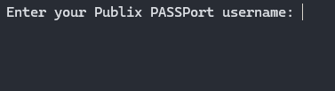
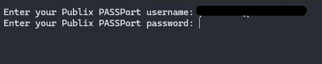
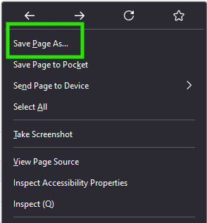
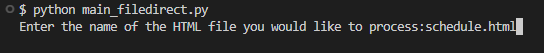
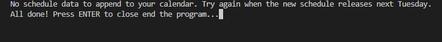
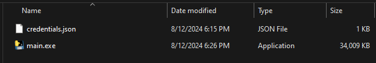

# Publix PASSPort Calendar Tool
## by Haaris Khalique
___

This Python program retrieves your most recent schedule data from Publix PASSPort's schedule page and creates corresponding events in your Google Calendar. 

Selenium automates the login process and BeautifulSoup processes the HTML to scrape pertinent information used in creating Calendar events.

## Installation
This program was written with Python 3.12.3
To ensure compatibility, please make sure you have Python 3.12 installed.

Currently, only Windows instructions are provided. The browser used by the program is Microsoft Edge. You may choose to use Firefox or  Chrome by modifying **schedule_fetcher.py** (lines 18-20) to select your browser of choice.

**1. Clone the repository to your machine:**
```
git clone https://github.com/HaarisKhalique/PublixPASSPort-Calendar-Integration.git
```
**2. Create a virtual environment:** 
Isolate this program's packages from other projects on your machine. See [official Python documentation](https://docs.python.org/3/library/venv.html) for more on virtual environments.


Create the virtual environment:
```
python -m venv /path/to/new/virtual/environment
```
Activate the environment:
```
C:\> <venv>\Scripts\activate.bat
```

**3. Install required packages:**
```
pip install requirements.txt
```
 
**4. Set up Google Cloud environment**
To call the Google Calendar API, you will need credentials authorizing the program to access the requested service. **See the [Google Calendar API quickstart documentation](https://developers.google.com/calendar/api/quickstart/python#set-up-environment) and refer to the "Set up your environment" section to guide you.**

___
## Usage
After you have configured your Google Cloud environment and have your **credentials.json** file in the project directory, you are ready to execute the program. There are two files:
- **main_auto.py** - This file will run the web automation procedure using Selenium to pas your login to Publix PASSPort and retrieve the latest schedule.
- **main_filedirect.py** - This file does not automate login. You will download the HTML source manually and provide the file directly for processing. It is useful if you wish to access past schedule data to add to your calendar.


### Method 1: Automated Schedule Retrieval using Selenium
**1. Execute the program by issuing the following command:**
```
python main_auto.py
```

**2. Type in your PASSPort username:**

Press **ENTER**.

**3. Enter your PASSPort password:**

No characters are displayed in the terminal while inputting your password.
Press **ENTER**.

Selenium will then automate the login process by opening a browser instance and passing the credentials you provided to Publix PASSPort.

**4. Complete Two-Factor Authentication using the Microsoft Authenticator.**
If you have not set up 2FA with your PASSPort account, set it up for use with Microsoft Authenticator.
Selenium will then navigate to the latest schedule, obtain the HTML source, and close the browser.

**5. Authorize the program to view, modify, and create events** 
Upon first access to your Google Calendar, you will be asked if you trust the program to edit your calendar. Verify that the **credentials.json** you downloaded is from the Cloud project you created and authorize the program to modify your calendars.

A **token.json** file will be created in your working directory which will allow you to skip the previous trust/authorize step in the future. **KEEP THIS FILE SECURE** as it is your personal access token to your calendar.

**6. Check your calendar to see your new events!**


### Method 2: Manual Schedule Retrieval
This method presents a simpler approach and is suited for those who want Google Calendar integration, but want to automate the login process.

**1. Log in to Publix PASSPort and access the schedule week you wish to add to your calendar.**

**2. Download the HTML source by right-clicking anywhere on the page and clicking "Save Page As..." :**


**3. Rename the file to something easy to remember and save in the project directory.**

**4. In terminal, navigate to the project directory and issue the following command:**
```
python main_filedirect.py
```
**5. You will be prompted to enter your HTML file name with file extension (verify whether your file extension is **.htm** or **.html**).**

Press **ENTER**. 
The program continues from here as normal. The HTML will be processed for schedule information and events will be created in your Google Calendar!

**Note:** With either method, if there is no schedule data present in the HTML, no attempt will be made to access your Google Calendar and you will see this message:

___
## Creating an Executable File
For greater simplicity, you may wish to create an executable file to run the program. You will simply create an executable and keep your **credentials.json** within the same directory.

**1. Install pyinstaller:**
```
pip install pyinstaller
```
**2. Create an executable file:**
```
pyinstaller --onefile main_auto.py
```
or
```
pyinstaller --onefile main_filedirect.py
```
**3. Move the executable file to your desired location.**

Place **credentials.json** in the same folder. Your **token.json** will be created here after your first execution.
___
## Developer's Note
This program was developed as a personal side project to explore Python, web automation, data scraping, and leveraging an existing API to create a feature that I have long desired. I intend to continue refining and updating the project as it is still a WIP.

While I am employed by Publix, this project was not developed as part of my role there, nor is it endorsed by or affiliated with Publix in any official capacity. This project is for personal and educational purposes only, and no profit is being made from it.
